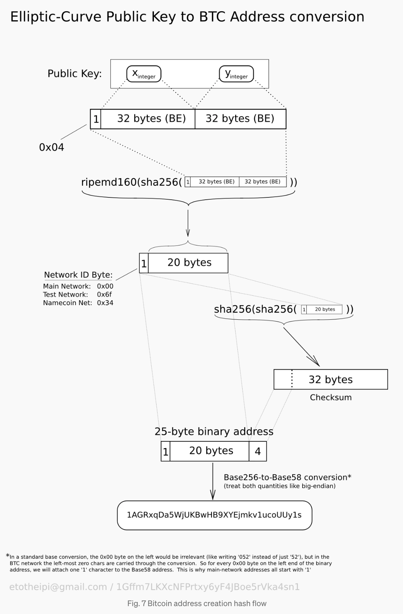

# Secp256k1

* Elliptic curve used in Bitcoin's public-key cryptograph

### Resources

* https://en.bitcoin.it/wiki/Secp256k1
* https://medium.com/asecuritysite-when-bob-met-alice/a-bluffers-guide-to-secp256k1-404e423e612
* https://medium.com/coinmonks/elliptic-curve-cryptography-6de8fc748b8b


**********************

### History

* Bitcoin uses secp256k1 with the ECDSA algorithm. 

Reason behind its success and Bitcoin: 

>secp256k1 was constructed in a special non-random way which allows for especially efficient computation. As a result, it is often more than 30% faster than other curves if the implementation is sufficiently optimized.

### Application

* ECDSA (digital signing)
* ECDH (key exchange)
	* Diffie-Helman. Used to create a shared key.


### Technical details

Sextuple

```
T = (p,a,b,G,n,h) 

p = 2256 - 232 - 29 - 28 - 27 - 26 - 24 - 1

E: y2 = x3+ax+b over Fp
```

The curve in fact uses the Weirstrass form of an eliptic curve: 

```
y^2 = x^3 + 7 (mod p)
```

The order of the curve (n) relates to the number of possible points for the eliptic curve. 

* **Public and private key**

	* 256-bit private key (32 bytes)
	* 512-bit public key value ---> It it a point on the eliptic curve. Then it gets reduced to 33 bytes.


*************


### How this applies to the addresses we see today?
	

* The addresses looks different than a number and points on a curve. 

* That´s because they are hashed in such a way to reduce the size of the string for light weight ease of use. 

* In Bitcoin, the coordinates of Q are combined and put through a cascade of hashing algorithms designed to compress the key and add a validity checksum for address checking




* In BTC The 256 refers to the size of the private key.


